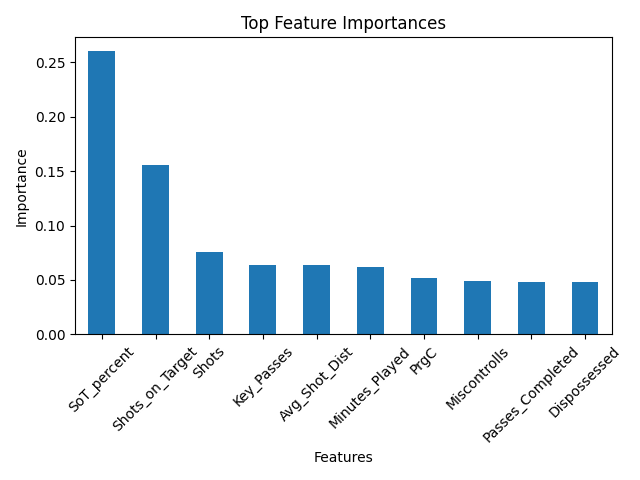

# Player Overperformance Prediction (xG-Based)

This project applies machine learning to identify football players who overperform relative to their expected goals (xG).

The objective is to classify players as **overperformers** (scoring more goals than expected) or **non-overperformers**, using performance metrics such as shooting accuracy, shot volume, and ball progression.


## Problem Definition

Expected Goals (xG) is widely used to evaluate chance quality, but it does not fully capture player finishing ability.

This project frames overperformance as a **binary classification problem**:

* **1 (Overperformer):** Goals > xG
* **0 (Non-overperformer):** Goals ≤ xG


## Dataset

The dataset contains player-level statistics from European football leagues, including:

* Shooting metrics (shots, shots on target, accuracy)
* Passing and creativity metrics
* Possession and progression metrics
* Physical and performance indicators


## Approach

### 1. Data Preparation

* Selected relevant offensive and performance-related features
* Removed variables that directly leak the target (e.g., goals, xG differences)
* Handled missing values

### 2. Class Imbalance

* Dataset was imbalanced (~22% overperformers)
* Models were evaluated prioritizing **recall**

### 3. Models

* **Logistic Regression (baseline)**
* **Random Forest (final model)**


## Model Results

| Model               | Recall (1) | Precision (1) | Accuracy |
| ------------------- | ---------- | ------------- | -------- |
| Logistic Regression | 0.63       | 0.49          | 0.65     |
| Random Forest       | 0.68       | 0.53          | 0.69     |

The Random Forest model improved detection of overperforming players while maintaining better overall balance.


## Key Insights

* **Shooting accuracy (SoT%) is the strongest predictor of overperformance**
* Shot volume (shots, shots on target) also plays a significant role
* Finishing efficiency is more predictive than opportunity volume alone


## Feature Importance




## Limitations

* The model does not explicitly account for player position, which may affect interpretation
* Defensive and goalkeeper metrics are less relevant to this task
* Overperformance may include randomness (variance), not only skill


## Applications

* Player scouting and recruitment
* Identifying undervalued players
* Performance evaluation beyond traditional metrics


## Project Structure

```
player-overperformance-ml/
├── data/
├── notebooks/
├── images/
├── README.md
└── requirements.txt
```


## Reproducibility

To run this project:

```bash
pip install -r requirements.txt
```

Open the notebook in:

```
notebooks/overperformance_model.ipynb
```

## Author

Gabriela Cárdenas
Aspiring Sports Data Scientist
